# ZenKoi Mobile - Package Diagram

## Package Diagram (PlantUML Notation)

```plantuml
@startuml ZenKoi_Mobile_Package_Diagram

!define RECTANGLE class

skinparam packageStyle rectangle
skinparam package {
    BackgroundColor #f8f9fa
    BorderColor #333333
    FontColor #333333
    FontSize 14
    FontStyle bold
}

skinparam component {
    BackgroundColor #e3f2fd
    BorderColor #1976d2
}

title ZenKoi Mobile - Package Diagram

' ==================== PRESENTATION LAYER ====================
package "Presentation Layer" as PL #E8F5E9 {

    package "app" as APP #C8E6C9 {
        package "(auth)" as AUTH_PAGES {
            [login/]
            [register/]
            [_layout.tsx]
        }

        package "(home)" as HOME_PAGES {
            [index.tsx] as HOME_INDEX
            [profile.tsx]
            [_layout.tsx] as HOME_LAYOUT

            package "breeding/" as BREEDING_PAGES {
                [Breeding Screens]
            }
            package "incidents/" as INCIDENTS_PAGES {
                [Incident Screens]
            }
            package "koi/" as KOI_PAGES {
                [Koi Fish Screens]
            }
            package "pond/" as POND_PAGES {
                [Pond Screens]
            }
            package "scan/" as SCAN_PAGES {
                [Scan Screens]
            }
            package "tasks/" as TASKS_PAGES {
                [Task Screens]
            }
            package "water/" as WATER_PAGES {
                [Water Screens]
            }
        }
    }

    package "components" as COMPONENTS #A5D6A7 {
        package "breeding/" as BREEDING_COMP {
            [ChangePondModal]
            [CountEggModal]
            [ClassificationStageSection]
            [FryFishInfo]
            [IncubationSummary]
            [SelectionModal]
            [...]
        }

        package "incidents/" as INCIDENTS_COMP {
            [CreateIncidentModal]
            [IncidentCard]
            [IncidentFilterModal]
            [ResolveIncidentModal]
            [SelectAssetModal]
            [...]
        }

        package "water/" as WATER_COMP {
            [CreatePondModal]
            [EditPondModal]
            [WaterParameters]
            [PondStats]
            [FishManagement]
            [...]
        }

        package "tasks/" as TASKS_COMP {
            [TaskCard]
            [TaskCompletionModal]
        }

        package "pond/" as POND_COMP {
            [CreatePondTypeModal]
            [EditPondTypeModal]
        }

        package "icons/" as ICONS {
            [FishSvg]
            [PondSvg]
        }

        package "Common Components" as COMMON_COMP {
            [AnimatedBackground]
            [CustomAlert]
            [InputField]
            [EnhancedInputField]
            [Loading]
            [LoginPage]
            [RegisterPage]
            [ContextMenuField]
            [WaterAlertBottomSheet]
        }
    }
}

' ==================== BUSINESS LOGIC LAYER ====================
package "Business Logic Layer" as BLL #E3F2FD {

    package "hooks" as HOOKS #BBDEFB {
        package "Authentication" as AUTH_HOOKS {
            [useAuth]
            [useUserDetails]
        }

        package "Koi Management" as KOI_HOOKS {
            [useKoiFish]
            [useVariety]
            [usePattern]
        }

        package "Pond Management" as POND_HOOKS {
            [usePond]
            [usePondType]
            [useArea]
        }

        package "Breeding Management" as BREEDING_HOOKS {
            [useBreedingProcess]
            [useEggBatch]
            [useFryFish]
            [useClassificationStage]
            [useClassificationRecord]
            [useFrySurvivalRecord]
            [useIncubationDailyRecord]
            [usePacketFish]
            [usePondPacketFish]
        }

        package "Water Management" as WATER_HOOKS {
            [useWaterParameterRecord]
            [useWaterParameterThreshold]
            [useWaterAlert]
        }

        package "Incident Management" as INCIDENT_HOOKS {
            [useIncident]
            [useIncidentType]
        }

        package "Task Management" as TASK_HOOKS {
            [useWorkSchedule]
            [useFarmDashboard]
        }

        package "Utilities" as UTIL_HOOKS {
            [useDebounce]
            [useUpload]
            [useSignalR]
            [useNotifications]
            [useExpoPushToken]
        }
    }
}

' ==================== DATA ACCESS LAYER ====================
package "Data Access Layer" as DAL #FFF3E0 {

    package "lib" as LIB #FFE0B2 {

        package "api" as API {
            [apiClient.ts] as API_CLIENT

            package "services/" as API_SERVICES #FFCC80 {
                [fetchAuth]
                [fetchKoiFish]
                [fetchPond]
                [fetchBreedingProcess]
                [fetchEggBatch]
                [fetchFryFish]
                [fetchClassificationStage]
                [fetchClassificationRecord]
                [fetchFrySurvivalRecord]
                [fetchIncubationDailyRecord]
                [fetchIncident]
                [fetchIncidentType]
                [fetchWaterParameterRecord]
                [fetchWaterParameterThreshold]
                [fetchWaterAlert]
                [fetchWorkSchedule]
                [fetchFarmDashboard]
                [fetchArea]
                [fetchPondType]
                [fetchVariety]
                [fetchPattern]
                [fetchPacketFish]
                [fetchPondPacketFish]
                [fetchUpload]
                [fetchUser]
            }
        }

        package "services" as SERVICES #FFB74D {
            [notificationService]
            [signalRService]
        }

        package "store" as STORE #FFA726 {
            [authStore]
        }

        package "types" as TYPES #FF9800 {
            [alert.ts]
        }

        package "utils" as UTILS #FB8C00 {
            [capacityLiters]
            [formatDate]
            [formatKoiAge]
            [timezone]
        }
    }
}

' ==================== ASSETS ====================
package "Assets" as ASSETS #F3E5F5 {
    [fonts/]
    [images/]
    [videos/]
}

' ==================== DEPENDENCIES ====================

' Presentation -> Business Logic
AUTH_PAGES ..> AUTH_HOOKS : <<import>>
HOME_PAGES ..> KOI_HOOKS : <<import>>
HOME_PAGES ..> POND_HOOKS : <<import>>
HOME_PAGES ..> BREEDING_HOOKS : <<import>>
HOME_PAGES ..> WATER_HOOKS : <<import>>
HOME_PAGES ..> INCIDENT_HOOKS : <<import>>
HOME_PAGES ..> TASK_HOOKS : <<import>>

BREEDING_COMP ..> BREEDING_HOOKS : <<import>>
INCIDENTS_COMP ..> INCIDENT_HOOKS : <<import>>
WATER_COMP ..> WATER_HOOKS : <<import>>
WATER_COMP ..> POND_HOOKS : <<import>>
TASKS_COMP ..> TASK_HOOKS : <<import>>

' Business Logic -> Data Access
AUTH_HOOKS ..> API_SERVICES : <<import>>
AUTH_HOOKS ..> STORE : <<import>>
KOI_HOOKS ..> API_SERVICES : <<import>>
POND_HOOKS ..> API_SERVICES : <<import>>
BREEDING_HOOKS ..> API_SERVICES : <<import>>
WATER_HOOKS ..> API_SERVICES : <<import>>
INCIDENT_HOOKS ..> API_SERVICES : <<import>>
TASK_HOOKS ..> API_SERVICES : <<import>>
UTIL_HOOKS ..> SERVICES : <<import>>

' API Services -> API Client
API_SERVICES ..> API_CLIENT : <<import>>

' Components use common components
BREEDING_COMP ..> COMMON_COMP : <<import>>
INCIDENTS_COMP ..> COMMON_COMP : <<import>>
WATER_COMP ..> COMMON_COMP : <<import>>

' Hooks use utilities
HOOKS ..> UTILS : <<import>>
HOOKS ..> TYPES : <<import>>

@enduml
```



---

## ASCII Package Diagram

```
┌─────────────────────────────────────────────────────────────────────────────────────────┐
│                              ZenKoi Mobile - Package Diagram                             │
└─────────────────────────────────────────────────────────────────────────────────────────┘

┌─────────────────────────────────────────────────────────────────────────────────────────┐
│                              PRESENTATION LAYER                                          │
│  ┌────────────────────────────────────────────────────────────────────────────────────┐ │
│  │  app/                                                                               │ │
│  │  ┌──────────────────────┐    ┌─────────────────────────────────────────────────┐   │ │
│  │  │     (auth)/          │    │                    (home)/                       │   │ │
│  │  │  ┌────────────────┐  │    │  ┌─────────┐ ┌─────────┐ ┌─────────┐ ┌────────┐ │   │ │
│  │  │  │ login/         │  │    │  │breeding/│ │incidents│ │  koi/   │ │ pond/  │ │   │ │
│  │  │  │ register/      │  │    │  └─────────┘ └─────────┘ └─────────┘ └────────┘ │   │ │
│  │  │  │ _layout.tsx    │  │    │  ┌─────────┐ ┌─────────┐ ┌─────────┐            │   │ │
│  │  │  └────────────────┘  │    │  │  scan/  │ │ tasks/  │ │ water/  │            │   │ │
│  │  └──────────────────────┘    │  └─────────┘ └─────────┘ └─────────┘            │   │ │
│  │                              │  index.tsx, profile.tsx, _layout.tsx             │   │ │
│  │                              └─────────────────────────────────────────────────┘   │ │
│  └────────────────────────────────────────────────────────────────────────────────────┘ │
│                                            │                                             │
│                                            ▼                                             │
│  ┌────────────────────────────────────────────────────────────────────────────────────┐ │
│  │  components/                                                                        │ │
│  │  ┌───────────┐ ┌───────────┐ ┌───────────┐ ┌───────────┐ ┌───────────┐            │ │
│  │  │ breeding/ │ │ incidents/│ │  water/   │ │  tasks/   │ │   pond/   │            │ │
│  │  │ 15 files  │ │ 12 files  │ │ 10 files  │ │  2 files  │ │  2 files  │            │ │
│  │  └───────────┘ └───────────┘ └───────────┘ └───────────┘ └───────────┘            │ │
│  │  ┌───────────┐ ┌─────────────────────────────────────────────────────┐            │ │
│  │  │  icons/   │ │              Common Components                       │            │ │
│  │  │  2 files  │ │ CustomAlert, Loading, InputField, LoginPage, etc.   │            │ │
│  │  └───────────┘ └─────────────────────────────────────────────────────┘            │ │
│  └────────────────────────────────────────────────────────────────────────────────────┘ │
└─────────────────────────────────────────────────────────────────────────────────────────┘
                                            │
                                   <<import>>
                                            ▼
┌─────────────────────────────────────────────────────────────────────────────────────────┐
│                              BUSINESS LOGIC LAYER                                        │
│  ┌────────────────────────────────────────────────────────────────────────────────────┐ │
│  │  hooks/  (29 custom hooks)                                                          │ │
│  │  ┌─────────────────┐ ┌─────────────────┐ ┌─────────────────┐ ┌─────────────────┐   │ │
│  │  │  Authentication │ │ Koi Management  │ │ Pond Management │ │Breeding Mgmt    │   │ │
│  │  │  ─────────────  │ │ ─────────────── │ │ ─────────────── │ │───────────────  │   │ │
│  │  │  useAuth        │ │ useKoiFish      │ │ usePond         │ │useBreedingProcess│  │ │
│  │  │  useUserDetails │ │ useVariety      │ │ usePondType     │ │useEggBatch      │   │ │
│  │  │                 │ │ usePattern      │ │ useArea         │ │useFryFish       │   │ │
│  │  │                 │ │                 │ │                 │ │useClassification│   │ │
│  │  └─────────────────┘ └─────────────────┘ └─────────────────┘ └─────────────────┘   │ │
│  │  ┌─────────────────┐ ┌─────────────────┐ ┌─────────────────┐ ┌─────────────────┐   │ │
│  │  │ Water Management│ │Incident Mgmt    │ │ Task Management │ │   Utilities     │   │ │
│  │  │ ─────────────── │ │───────────────  │ │ ─────────────── │ │ ─────────────── │   │ │
│  │  │useWaterParameter│ │ useIncident     │ │ useWorkSchedule │ │ useDebounce     │   │ │
│  │  │useWaterThreshold│ │ useIncidentType │ │ useFarmDashboard│ │ useUpload       │   │ │
│  │  │ useWaterAlert   │ │                 │ │                 │ │ useSignalR      │   │ │
│  │  │                 │ │                 │ │                 │ │ useNotifications│   │ │
│  │  └─────────────────┘ └─────────────────┘ └─────────────────┘ └─────────────────┘   │ │
│  └────────────────────────────────────────────────────────────────────────────────────┘ │
└─────────────────────────────────────────────────────────────────────────────────────────┘
                                            │
                                   <<import>>
                                            ▼
┌─────────────────────────────────────────────────────────────────────────────────────────┐
│                              DATA ACCESS LAYER                                           │
│  ┌────────────────────────────────────────────────────────────────────────────────────┐ │
│  │  lib/                                                                               │ │
│  │  ┌──────────────────────────────────────────────────────────────────────────────┐  │ │
│  │  │  api/                                                                         │  │ │
│  │  │  ┌────────────────┐  ┌─────────────────────────────────────────────────────┐ │  │ │
│  │  │  │ apiClient.ts   │  │  services/ (25 fetch services)                      │ │  │ │
│  │  │  │ (Axios config) │  │  fetchAuth, fetchKoiFish, fetchPond, fetchBreeding  │ │  │ │
│  │  │  │                │  │  fetchIncident, fetchWaterParameter, fetchWorkSchedule│ │  │ │
│  │  │  │                │  │  fetchEggBatch, fetchFryFish, fetchClassification...│ │  │ │
│  │  │  └────────────────┘  └─────────────────────────────────────────────────────┘ │  │ │
│  │  └──────────────────────────────────────────────────────────────────────────────┘  │ │
│  │  ┌─────────────────┐ ┌─────────────────┐ ┌─────────────────┐ ┌─────────────────┐   │ │
│  │  │    services/    │ │     store/      │ │     types/      │ │     utils/      │   │ │
│  │  │ ─────────────── │ │ ─────────────── │ │ ─────────────── │ │ ─────────────── │   │ │
│  │  │notification     │ │ authStore.ts    │ │ alert.ts        │ │ capacityLiters  │   │ │
│  │  │  Service        │ │ (Zustand)       │ │                 │ │ formatDate      │   │ │
│  │  │signalRService   │ │                 │ │                 │ │ formatKoiAge    │   │ │
│  │  │                 │ │                 │ │                 │ │ timezone        │   │ │
│  │  └─────────────────┘ └─────────────────┘ └─────────────────┘ └─────────────────┘   │ │
│  └────────────────────────────────────────────────────────────────────────────────────┘ │
└─────────────────────────────────────────────────────────────────────────────────────────┘
                                            │
                                   <<access>>
                                            ▼
┌─────────────────────────────────────────────────────────────────────────────────────────┐
│                              EXTERNAL SERVICES                                           │
│  ┌─────────────────┐ ┌─────────────────┐ ┌─────────────────┐ ┌─────────────────┐        │
│  │   Backend API   │ │  SignalR Hub    │ │  Expo Push      │ │ Cloud Storage   │        │
│  │   (REST API)    │ │  (Real-time)    │ │  Notification   │ │ (Images/Videos) │        │
│  └─────────────────┘ └─────────────────┘ └─────────────────┘ └─────────────────┘        │
└─────────────────────────────────────────────────────────────────────────────────────────┘
```

---

## Package Descriptions

### 1. PRESENTATION LAYER

#### 1.1 `app/` - Application Routes

**Mô tả:** Package chứa tất cả các màn hình và routes của ứng dụng, sử dụng Expo Router (file-based routing).

| Sub-package         | Mô tả                                                                                            |
| ------------------- | ------------------------------------------------------------------------------------------------ |
| `(auth)/`           | Chứa các màn hình xác thực: đăng nhập (`login/`), đăng ký (`register/`), và layout cho auth flow |
| `(home)/`           | Chứa tất cả màn hình chính sau khi đăng nhập                                                     |
| `(home)/breeding/`  | Màn hình quản lý quy trình sinh sản cá Koi                                                       |
| `(home)/incidents/` | Màn hình quản lý sự cố trong trang trại                                                          |
| `(home)/koi/`       | Màn hình quản lý thông tin cá Koi (thêm, sửa, xem chi tiết, danh sách)                           |
| `(home)/pond/`      | Màn hình quản lý ao nuôi                                                                         |
| `(home)/scan/`      | Màn hình quét/nhận diện cá Koi bằng camera                                                       |
| `(home)/tasks/`     | Màn hình quản lý công việc/lịch làm việc                                                         |
| `(home)/water/`     | Màn hình quản lý thông số nước                                                                   |

#### 1.2 `components/` - Reusable UI Components

**Mô tả:** Package chứa các component UI tái sử dụng trong toàn bộ ứng dụng.

| Sub-package  | Số files | Mô tả                                                                                                                                                             |
| ------------ | -------- | ----------------------------------------------------------------------------------------------------------------------------------------------------------------- |
| `breeding/`  | 15       | Components cho tính năng sinh sản: CountEggModal, FryFishInfo, ClassificationStageSection, SelectionModal, etc.                                                   |
| `incidents/` | 12       | Components cho tính năng sự cố: IncidentCard, CreateIncidentModal, ResolveIncidentModal, SelectAssetModal, etc.                                                   |
| `water/`     | 10       | Components cho tính năng quản lý nước: CreatePondModal, WaterParameters, PondStats, FishManagement, etc.                                                          |
| `tasks/`     | 2        | Components cho tính năng công việc: TaskCard, TaskCompletionModal                                                                                                 |
| `pond/`      | 2        | Components cho loại ao: CreatePondTypeModal, EditPondTypeModal                                                                                                    |
| `icons/`     | 2        | SVG icons tùy chỉnh: FishSvg, PondSvg                                                                                                                             |
| **Common**   | 10       | Components dùng chung: CustomAlert, Loading, InputField, EnhancedInputField, AnimatedBackground, LoginPage, RegisterPage, ContextMenuField, WaterAlertBottomSheet |

---

### 2. BUSINESS LOGIC LAYER

#### 2.1 `hooks/` - Custom React Hooks

**Mô tả:** Package chứa tất cả custom hooks để quản lý business logic, data fetching với React Query, và các utility hooks.

| Category                | Hooks                                                                                                                                                                                            | Mô tả                                                                  |
| ----------------------- | ------------------------------------------------------------------------------------------------------------------------------------------------------------------------------------------------ | ---------------------------------------------------------------------- |
| **Authentication**      | `useAuth`, `useUserDetails`                                                                                                                                                                      | Xử lý đăng nhập, đăng xuất, quản lý thông tin người dùng               |
| **Koi Management**      | `useKoiFish`, `useVariety`, `usePattern`                                                                                                                                                         | CRUD cá Koi, quản lý giống và hoa văn                                  |
| **Pond Management**     | `usePond`, `usePondType`, `useArea`                                                                                                                                                              | CRUD ao nuôi, loại ao, và khu vực                                      |
| **Breeding Management** | `useBreedingProcess`, `useEggBatch`, `useFryFish`, `useClassificationStage`, `useClassificationRecord`, `useFrySurvivalRecord`, `useIncubationDailyRecord`, `usePacketFish`, `usePondPacketFish` | Quản lý toàn bộ quy trình sinh sản từ ghép cặp đến phân loại           |
| **Water Management**    | `useWaterParameterRecord`, `useWaterParameterThreshold`, `useWaterAlert`                                                                                                                         | Quản lý thông số nước và cảnh báo                                      |
| **Incident Management** | `useIncident`, `useIncidentType`                                                                                                                                                                 | Quản lý sự cố và loại sự cố                                            |
| **Task Management**     | `useWorkSchedule`, `useFarmDashboard`                                                                                                                                                            | Quản lý lịch làm việc và dashboard tổng quan                           |
| **Utilities**           | `useDebounce`, `useUpload`, `useSignalR`, `useNotifications`, `useExpoPushToken`                                                                                                                 | Các hook tiện ích: debounce, upload file, real-time, push notification |

---

### 3. DATA ACCESS LAYER

#### 3.1 `lib/api/` - API Client & Services

**Mô tả:** Package chứa cấu hình API client và các service gọi REST API.

| File/Folder    | Mô tả                                                                                       |
| -------------- | ------------------------------------------------------------------------------------------- |
| `apiClient.ts` | Cấu hình Axios instance với base URL, interceptors, token management                        |
| `services/`    | 25 fetch services cho từng entity (fetchAuth, fetchKoiFish, fetchPond, fetchIncident, etc.) |

**Chi tiết `services/` (25 files):**

- **Auth & User:** `fetchAuth.ts`, `fetchUser.ts`
- **Koi:** `fetchKoiFish.ts`, `fetchVariety.ts`, `fetchPattern.ts`
- **Pond:** `fetchPond.ts`, `fetchPondType.ts`, `fetchArea.ts`
- **Breeding:** `fetchBreedingProcess.ts`, `fetchEggBatch.ts`, `fetchFryFish.ts`, `fetchClassificationStage.ts`, `fetchClassificationRecord.ts`, `fetchFrySurvivalRecord.ts`, `fetchIncubationDailyRecord.ts`, `fetchPacketFish.ts`, `fetchPondPacketFish.ts`
- **Water:** `fetchWaterParameterRecord.ts`, `fetchWaterParameterThreshold.ts`, `fetchWaterAlert.ts`
- **Incident:** `fetchIncident.ts`, `fetchIncidentType.ts`
- **Task:** `fetchWorkSchedule.ts`, `fetchFarmDashboard.ts`
- **Upload:** `fetchUpload.ts`

#### 3.2 `lib/services/` - External Services

**Mô tả:** Package chứa các service kết nối dịch vụ bên ngoài.

| Service                  | Mô tả                                     |
| ------------------------ | ----------------------------------------- |
| `notificationService.ts` | Quản lý push notifications với Expo       |
| `signalRService.ts`      | Kết nối SignalR hub cho real-time updates |

#### 3.3 `lib/store/` - State Management

**Mô tả:** Package chứa global state management sử dụng Zustand.

| Store          | Mô tả                                                            |
| -------------- | ---------------------------------------------------------------- |
| `authStore.ts` | Quản lý authentication state: user info, tokens, isAuthenticated |

#### 3.4 `lib/types/` - Type Definitions

**Mô tả:** Package chứa các TypeScript type definitions dùng chung.

| File       | Mô tả                             |
| ---------- | --------------------------------- |
| `alert.ts` | Type definitions cho water alerts |

#### 3.5 `lib/utils/` - Utility Functions

**Mô tả:** Package chứa các helper functions dùng chung.

| Utility             | Mô tả                                  |
| ------------------- | -------------------------------------- |
| `capacityLiters.ts` | Tính toán dung tích ao                 |
| `formatDate.ts`     | Format ngày tháng theo locale Việt Nam |
| `formatKoiAge.ts`   | Tính tuổi cá Koi                       |
| `timezone.ts`       | Xử lý timezone                         |

---

### 4. ASSETS

#### 4.1 `assets/` - Static Resources

**Mô tả:** Package chứa các tài nguyên tĩnh của ứng dụng.

| Folder    | Mô tả                                        |
| --------- | -------------------------------------------- |
| `fonts/`  | Custom fonts cho ứng dụng                    |
| `images/` | Hình ảnh tĩnh (logo, icons, backgrounds)     |
| `videos/` | Video files cho splash screen hoặc hướng dẫn |

---

## Dependencies Summary

```
┌────────────────────┐     <<import>>      ┌────────────────────┐
│  Presentation      │ ──────────────────► │  Business Logic    │
│  (app, components) │                     │  (hooks)           │
└────────────────────┘                     └────────────────────┘
                                                    │
                                           <<import>>
                                                    ▼
                                           ┌────────────────────┐
                                           │  Data Access       │
                                           │  (lib/api, store)  │
                                           └────────────────────┘
                                                    │
                                           <<access>>
                                                    ▼
                                           ┌────────────────────┐
                                           │  External Services │
                                           │  (Backend, SignalR)│
                                           └────────────────────┘
```

| From                   | To                  | Dependency Type | Mô tả                                           |
| ---------------------- | ------------------- | --------------- | ----------------------------------------------- |
| `app/`                 | `hooks/`            | `<<import>>`    | Pages import hooks để fetch data và xử lý logic |
| `app/`                 | `components/`       | `<<import>>`    | Pages import reusable components                |
| `components/`          | `hooks/`            | `<<import>>`    | Components import hooks để fetch data           |
| `hooks/`               | `lib/api/services/` | `<<import>>`    | Hooks import API services để gọi REST API       |
| `hooks/`               | `lib/store/`        | `<<import>>`    | Hooks import stores để đọc/ghi global state     |
| `hooks/`               | `lib/utils/`        | `<<import>>`    | Hooks import utilities cho formatting           |
| `lib/api/services/`    | `apiClient`         | `<<import>>`    | All services use shared Axios client            |
| `lib/api/`             | Backend API         | `<<access>>`    | HTTP requests to REST API server                |
| `lib/services/signalR` | SignalR Hub         | `<<access>>`    | WebSocket connection for real-time              |

---

_Tài liệu được tạo tự động từ source code của ZenKoi Mobile App._
_Cập nhật: December 5, 2025_
